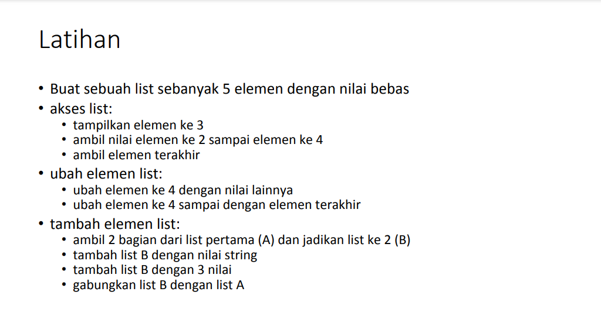
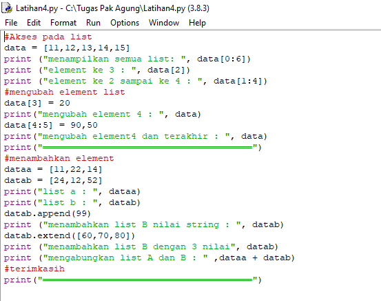
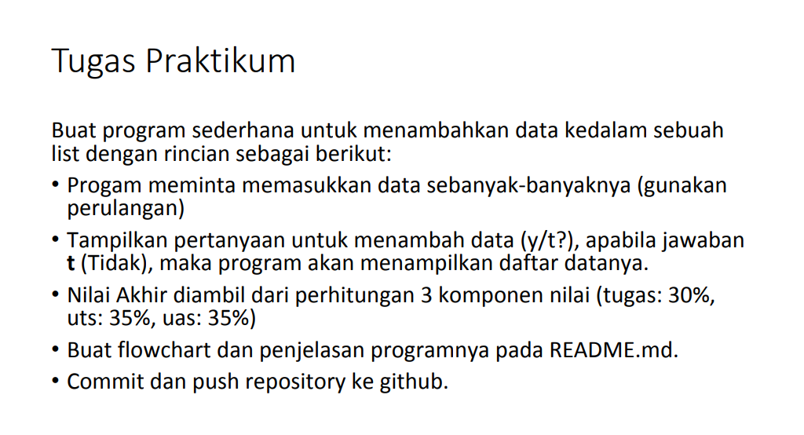
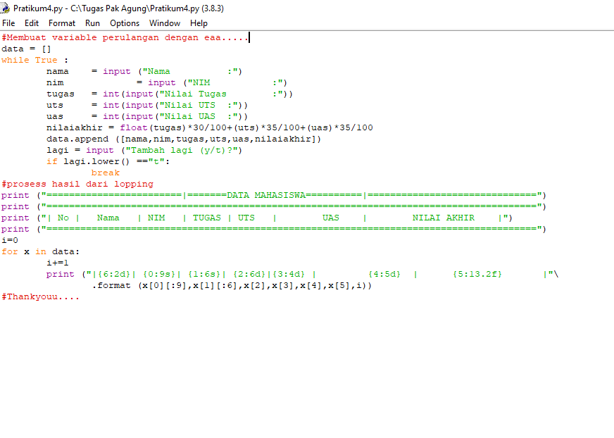

# Tugas Pertemuan 9 Dan Pengerttian
## Tugas Melengkapi Praktikum 9
| Nama | kelas | Nim | Matkul |
| -- | --- | ---- | ----------- |
| Muhammad Rifqi Rizqullah | TI.20.A2 | 312010263 | Bahasa Pemrograman |
## Daftar Isi
| No | ISI | PENJELASAN | 
| -- | --- | ---------- | 
| 1. | Latihan Praktikum 4 | [penjelasan](#TugasLatihan-4) | 
| 2. | Tugas Praktium 4 | [penjelasan](#TugasPraktikum-4) | 

## TugasLatihan 4


## Hasil Source Code
```python
#Akses pada list
data = [11,12,13,14,15]
print ("menampilkan semua list: ", data[0:6])
print ("element ke 3 : ", data[2])
print ("element ke 2 sampai ke 4 : ", data[1:4])
#mengubah element list
data[3] = 20
print("mengubah element 4 : ", data)
data[4:5] = 90,50
print("mengubah element4 dan terakhir : ", data)
print("══════════════════════════════════════")
#menambahkan element
dataa = [11,22,14]
datab = [24,12,52]
print("list a : ", dataa)
print("list b : ", datab)
datab.append(99)
print ("menambahkan list B nilai string : ", datab)
datab.extend([60,70,80])
print ("menambahkan list B dengan 3 nilai", datab)
print ("mengabungkan list A dan B : " ,dataa + datab)
#terimkasih
print("══════════════════════════════════════")
```
## Hasil Output 


## TugasPraktikum 4


## Hasil Source Code
```python
#Membuat variable perulangan dengan eaa.....
data = []
while True : 
	nama	= input	("Nama 		:")
	nim		= input ("NIM 		:")
	tugas	= int(input("Nilai Tugas        :"))
	uts 	= int(input("Nilai UTS 	:"))
	uas 	= int(input("Nilai UAS 	:"))
	nilaiakhir = float(tugas)*30/100+(uts)*35/100+(uas)*35/100 
	data.append ([nama,nim,tugas,uts,uas,nilaiakhir])
	lagi = input ("Tambah lagi (y/t)?")
	if lagi.lower() =="t":
		break
#prosess hasil dari lopping
print ("========================|=======DATA MAHASISWA==========|==============================")
print ("=======================================================================================")
print ("| No |	 Nama 	| NIM 	| TUGAS | UTS 	|	 UAS 	|	 NILAI AKHIR 	|")
print ("=======================================================================================")
i=0
for x in data:
	i+=1
	print ("|{6:2d}| {0:9s}| {1:6s}| {2:6d}|{3:4d} |	 {4:5d}	 | 	{5:13.2f} 	|"\
		.format (x[0][:9],x[1][:6],x[2],x[3],x[4],x[5],i))
#Thankyouu....

```
## Penjelasan 


1.) Pertama kita membuat variable list kosong.
data = []
ulang = True

    Variable ulang = True digunakan untuk mengontrol perulangan.

2.) Lalu kita membuat kondisi perulangan dan statement yang akan dijalankan ketika perulangan terjadi.

while ulang:
    nama = input("Masukkan Nama: ")
    nim = input("Masukkan NIM: ")
    tugas = int(input("Masukkan Nilai Tugas: "))
    uts = int(input("Masukkan Nilai UTS: "))
    uas = int(input("Masukkan Nilai UTS: "))
    akhir = (tugas * 30/100) + (uts * 35/100) + (uas * 35/100)

  	data
	  .append([nama, nim, tugas, uts, uas, int(akhir)])

    Dari statement diatas, kita akan diminta untuk menginput nama, nim, nilai tugas, nilai uts, dan nilai uas, lalu system akan menjumlahkan nilai-nilai tersebut dan menghasilkan nilai akhir. Setelah menginput berbagai data atau item, inputan item tersebut akan masuk ke dalam list 'nilai'

3.) Setelah membuat perulangan, kita membuat statement untuk menghentikan atau keluar dari perulangan yang terjadi.

    if (input("Tambah data (y/t)?") == 't'):
        ulang = False

    Untuk keluar dari perulangan kita hanya perlu menginputkan t apabila diminta pada saat program dijalankan. t akan membuat variable ulang = True menjadi ulang = False yang mana akan menghentikan perulangan yang terjadi.

4.) Terakhir kita akan mencetak hasil dari program yang telah dibuat.

```python
print("\n                      Daftar Nilai Mahasiswa")
print("==================================================================")
print("|No. |     Nama     |    NIM    | Tugas |  UTS  |  UAS  |  Akhir |")
print("==================================================================")
i = 0
for item in nilai:
    i += 1
    print("| {no:2d} | {nama:12s} | {nim:9s} | {tugas:5d} | {uts:5d} | {uas:5d} | {akhir:6.2f} |"
          .format(no=i, nama=item[0], nim=item[1], tugas=item[2], uts=item[3], uas=item[4], akhir=item[5]))
print("==================================================================")
```
Berikut hasil dari program data mahasiswa 



